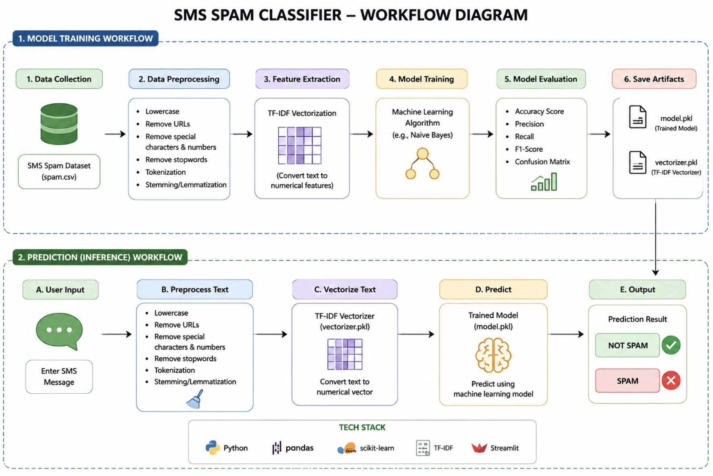
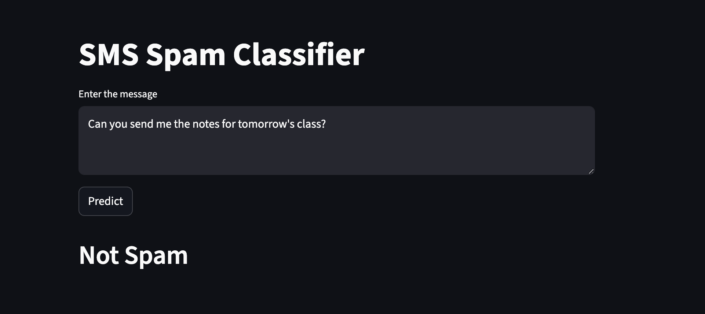
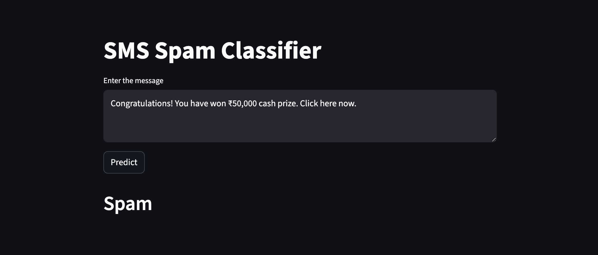
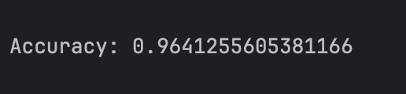

# 📩 SMS Spam Classifier

<p align="center">
  
</p>

## 📌 Project Summary

SMS Spam Classifier is a Machine Learning and Natural Language Processing (NLP) based application that automatically detects whether a text message is **Spam 🚫** or **Not Spam ✅**.

The system analyzes text messages, preprocesses them using NLP techniques, converts text into numerical vectors using **TF-IDF (Term Frequency-Inverse Document Frequency)**, and predicts the output using a trained machine learning model.

The project is deployed using **Streamlit** to provide an interactive and user-friendly web application interface.

---

## 🚀 Features

✅ Spam message detection

✅ Real-time prediction

✅ NLP-based text preprocessing

✅ TF-IDF vectorization

✅ Interactive Streamlit interface

✅ Machine learning prediction

✅ Fast and lightweight implementation

---

## 🛠 Technologies Used

| Technology | Purpose |
|------------|----------|
| Python | Programming language |
| Pandas | Data handling |
| NumPy | Numerical operations |
| NLTK | Text preprocessing |
| Scikit-learn | Machine learning |
| TF-IDF | Feature extraction |
| Pickle | Saving trained model |
| Streamlit | Web application |

---

# 📊 Project Workflow

The complete workflow of the project is shown below:

<p align="center">
  
</p>

---

# ⚙️ How SMS Spam Classifier Works

The working of the system consists of multiple stages:

### Step 1: Data Collection

The SMS dataset (`spam.csv`) is collected.

Dataset contains:

- Message text
- Spam/Ham labels

Example:

| Message | Label |
|----------|--------|
| Win ₹50,000 now | Spam |
| Meet me at 5 PM | Not Spam |

---

### Step 2: Data Preprocessing

The text message undergoes preprocessing:

✔ Convert text into lowercase

✔ Remove punctuation

✔ Remove special characters

✔ Remove stopwords

✔ Tokenization

✔ Stemming

Example:

Input:

```text
Congratulations!! You won ₹50,000 cash prize.
```

Output after preprocessing:

```text
congratul won cash prize
```

---

### Step 3: Feature Extraction

The processed text is converted into numerical vectors using:

```python
TF-IDF Vectorizer
```

TF-IDF calculates word importance and converts text into machine-readable numerical data.

---

### Step 4: Model Training

The transformed vectors are passed to the machine learning algorithm.

Algorithms commonly used:

- Naive Bayes
- Logistic Regression
- Random Forest

The trained model learns patterns between spam and normal messages.

---

### Step 5: Save Model

After training:

```text
model.pkl
vectorizer.pkl
```

files are generated and stored.

---

### Step 6: Prediction Phase

Prediction workflow:

```text
User Input
     ↓
Text Preprocessing
     ↓
TF-IDF Vectorization
     ↓
Machine Learning Model
     ↓
Spam / Not Spam
```

---

# 📱 Application Screenshots

## Normal Message Detection ✅

<p align="center">
  
</p>

---

## Spam Message Detection 🚫

<p align="center">
  
</p>

---

## Model Performance 📈

<p align="center">
  
</p>

---

# 📈 Model Evaluation Metrics

The model performance can be evaluated using:

- Accuracy
- Precision
- Recall
- F1 Score
- Confusion Matrix

Example:

```text
Accuracy = 98%
Precision = 97%
Recall = 96%
F1 Score = 96%
```

# ▶️ Installation

Clone repository:

```bash
git clone https://github.com/your-username/sms_spam_classifier.git
```

Move into directory:

```bash
cd sms_spam_classifier
```

Create virtual environment:

```bash
python -m venv .venv
```

Activate environment

Mac/Linux:

```bash
source .venv/bin/activate
```

Windows:

```bash
.venv\Scripts\activate
```

Install dependencies:

```bash
pip install -r requirements.txt
```

---

# ▶️ Run Application

```bash
streamlit run app/app.py
```

---

# 🧪 Sample Test Cases

### Not Spam

```text
Hey, where are you? I am waiting outside.
```

Output:

```text
Not Spam ✅
```

---

### Spam

```text
Congratulations! You won ₹50,000 cash prize.
Click here now.
```

Output:

```text
Spam 🚫
```

---

# 🌍 Real World Applications

SMS Spam Classification can be used in:

📧 Email Spam Detection

🏦 Banking Fraud Detection

📱 Mobile Messaging Apps

🛒 Marketing Message Filtering

🔒 Cybersecurity Systems

🏢 Customer Support Systems

📊 Social Media Content Filtering

---

# 🔮 Future Improvements

- Deep Learning implementation
- Cloud deployment
- Multi-language support
- Email spam detection
- Improved UI/UX
- Real-time API deployment

---
